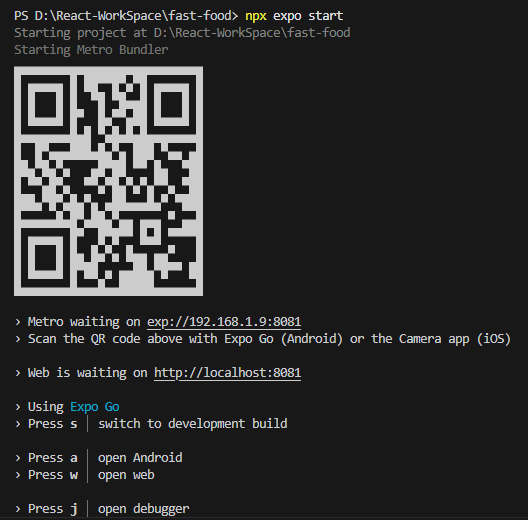

# Notes on developing React Native App with Expo

1. To create a react native application with expo, run the following command:

   ```pwsh
   npx create-expo-app@latest
   ```

   or

   ```pwsh
   npx create-expo-app@latest ./ #to create the app in the current folder, instead of creating new
   ```

2. Suggestions from Expo CLI:

   ````text
   To choose from all available templates (https://github.com/expo/expo/tree/main/templates) pass in the --template arg:
   $ npx create-expo-app --template

   To choose from all available examples (https://github.com/expo/examples) pass in the --example arg:
   $ npx create-expo-app --example

   ```

   ```

   ````

3. To start the expo app to run and preview, run the following command. It will start the app and generate a QR code to scan

   ```pwsh
   npx expo start
   ```

4. Download expo application and click Scan QR Code option to scan the QR code appearing in the terminal. Then, in few seconds, the app will be loaded in your mobile. Any changes made in the code will affect the app in real time.
   

5. Lets see the project structure anf description of the files.

   | File Name                                          | Uses                                                                                                                                                                                                                             |
   | -------------------------------------------------- | -------------------------------------------------------------------------------------------------------------------------------------------------------------------------------------------------------------------------------- |
   | tsconfig.json                                      | This file contains the rules that Typescript will use to enforce type safety throughout the project                                                                                                                              |
   | package.json                                       | Contains all of the proejcts dependencies, scripts and metadata                                                                                                                                                                  |
   | app.json                                           | Contains configuration options for the project which is called as app config. These options change the behavior of the project while developing, building, submitting or updating your app                                       |
   | eslint.config.js                                   | This file makes sure that our code is clean. The primary configuration file for ESLint, a powerful JavaScript linter. Its main purpose is to define and enforce coding standards and identify potential issues in your codebase. |
   | .gitignore                                         | This file ignores unnecessary files including .env files which will be skipped pushing to the production                                                                                                                         |
   | scripts/reset-project.js                           | This file resets the project to bare minimum code                                                                                                                                                                                |
   | hooks, constants, components, assets, app and more | These are boilerplate codes created for our development                                                                                                                                                                          |

6. Lets see the description about app config file

   ```json
   {
     "expo": {
       "name": "fast-food", // The name that will appear on the home screen or the app list
       "slug": "fast-food", // A URL-friendly name for your project that is unique across your account. Unique identifier for the project used by expo. Used for finding URL of the app when using on web.
       "version": "1.0.0", // Your app version
       "orientation": "portrait", // Locks your app to a specific orientation with portrait or landscape. Defaults to no lock. Valid values: default, portrait, landscape
       "icon": "./assets/images/icon.png", // Local path or remote URL to an image to use for your app's icon
       "scheme": "fastfood", // Scheme to enable deep linking. URL scheme(s) to link into your app.
       "userInterfaceStyle": "automatic", // Configuration to force the app to always use the light or dark user-interface appearance, such as "dark mode", or make it automatically adapt to the system preferences. If not provided, defaults to light. Requires expo-system-ui be installed in your project to work on Android.
       "newArchEnabled": true, // A Boolean value that indicates whether the app should use the new architecture. Defaults to true.
       "ios": {
         // Configuration that is specific to the iOS platform.
         "supportsTablet": true // Whether your standalone iOS app supports tablet screen sizes. Defaults to false.
       },
       "android": {
         // Configuration that is specific to the Android platform.
         "adaptiveIcon": {
           // Settings for an Adaptive Launcher Icon on Android.
           "foregroundImage": "./assets/images/adaptive-icon.png", // Local path or remote URL to an image to use for your app's icon on Android
           "backgroundColor": "#ffffff" // Color to use as the background for your app's Adaptive Icon on Android. Defaults to white, #FFFFFF. Has no effect if foregroundImage is not specified.
         },
         "edgeToEdgeEnabled": true // Enable your app to run in edge-to-edge mode. Default to false.
       },
       "web": {
         // Configuration that is specific to the web platform.
         "bundler": "metro", // Sets the bundler to use for the web platform. Only supported in the local CLI npx expo. Defaults to webpack if the @expo/webpack-config package is installed, if not, it defaults to metro.
         "output": "static", // Sets the export method for the web app for both expo start and expo export. static statically renders HTML files for every route in the app/ directory, which is available only in Expo Router apps. single outputs a Single Page Application (SPA), with a single index.html in the output folder, and has no statically indexable HTML. server outputs static HTML, and API Routes for hosting with a custom Node.js server. Defaults to single.
         "favicon": "./assets/images/favicon.png" // Relative path of an image to use for your app's favicon.
       },
       "plugins": [
         // Config plugins for adding extra functionality to your project
         "expo-router",
         [
           "expo-splash-screen",
           {
             "image": "./assets/images/splash-icon.png",
             "imageWidth": 200,
             "resizeMode": "contain",
             "backgroundColor": "#ffffff"
           }
         ]
       ],
       "experiments": {
         // Enable experimental features that may be unstable, unsupported, or removed without deprecation notices
         "typedRoutes": true // Enable support for statically typed links in Expo Router. This feature requires TypeScript be set up in your Expo Router v2 project.
       }
     }
   }
   ```

7. Now inside app/(tabs)/index.tsx is the main home page file. If we change anything in the code, it will reflect in the app immediately.

8. Now we need to reset the app using the scripts/reset-project.js file. Stop the existing server that we started using npx expo start by doing Ctrl + C. Then, run the following command:

   ```pwsh
   npm run reset-project
   ```

9. Delete the app-example folder now since it is no longer needed. We will have bare minimum code for our app to extend. Run the following command after resetting the project to start the app again. Clear the app in Expo in your mobile phone.

   ```pwsh
   npx expo start
   ```

10. Then, head over to Nativewind website [here](https://www.nativewind.dev/docs/getting-started/installation).

11. Install Nativewind with Tailwind CSS using the following command. (Follow the instructions in the official website for better referrence.)

    ```pwsh
    npx expo install nativewind react-native-reanimated@~3.17.4 react-native-safe-area-context@5.4.0
    npx expo install -D tailwindcss@^3.4.17 prettier-plugin-tailwindcss@^0.5.11
    ```

12. Run `npx tailwindcss init` to create a `tailwind.config.js` file

13. TL;DR - Follow the instructions to add the following snippets in the respective files as per the link mentioned above.
    1. Install Nativewind
    2. Setup Tailwind CSS
    3. Add the Babel preset
    4. Create or modify your metro.config.js
    5. Import your CSS file
    6. Modify your app.json
    7. TypeScript setup (optional)

14. If the tailwind configuration has to be applied to the right files, we need to add the correct path in the `tailwind.config.js`

    Changing from `content: ["./App.tsx", "./components/**/*.{js,jsx,ts,tsx}"],` to `content: ["./app/**/*.{js,jsx,ts,tsx}", "./components/**/*.{js,jsx,ts,tsx}"],`

15. If we are making the changes in the root configuration files and want to apply the changes, we need to either reload the application by pressing r in the terminal where app is running. Otherwise, we can stop the server and restart it using `npx expo start` and if we want to clear the build cache and start as fresh build, we can use `npx expo start --clear`.

16. We have named the file as globals.css instead of default global.css, make the changes as necessary in `_layout.tsx and index.tsx`. Also, modify the filename and relative path of it in metro.config.js as below.

    Changing from `module.exports = withNativeWind(config, { input: './global.css' })` to `module.exports = withNativeWind(config, { input: './app/globals.css' })`

17. We can extend our custom colors to the application by adding it in the themes.extend in tailwind.config.js as below:

    ```js
    /** @type {import('tailwindcss').Config} */
    module.exports = {
      content: [
        "./app/**/*.{js,jsx,ts,tsx}",
        "./components/**/*.{js,jsx,ts,tsx}",
      ],
      presets: [require("nativewind/preset")],
      theme: {
        extend: {
          colors: {
            red: {
              100: "#D33B0D",
            },
            green: {
              100: "#084137",
            },
          },
        },
      },
      plugins: [],
    };
    ```

18. Since we need to import lots of colors, fonts and assets/images to the project, head over to the [JS Mastery Asset Link](https://jsmastery.com/video-kit/d6633345-8797-4b96-8a4b-935618306d1d) for this tutorial and do the following steps:
    1. Copy paste the contents from `tailwind.config.js` from the website which includes all the colors that we need for this app and also the list of fonts to import.
    2. Click the assets link from there or from [here](https://drive.google.com/drive/u/0/folders/1cO2k9gz_Z8P6AV7cL49x6bI6t1Ac0LOo) which will take you to google drive and download the zip file and extract and replace it in the respective folders.

19. Create a folder `constants` in the root directory and create an `index.ts` file. Copy paste the contents from the JS Mastery Asset Link.

20. We will have problems in the import for the above file even if the imports are pointing to the correct assets. To make the system understand the imports, create a file `images.d.ts` file at the root directory. Copy paste the contents from the JS Mastery Asset Link.

21. Whatever files that we feel that we will use across all the components and files, we can import it under the `_layout.tsx` file. Importing useFonts and useEffect as follows.

    ```tsx
    import { useFonts } from "expo-font";
    import { SplashScreen, Stack } from "expo-router";

    import { useEffect } from "react";
    import "./globals.css";

    export default function RootLayout() {
      const [fontsLoaded, error] = useFonts({
        "QuickSand-Bold": require("../assets/fonts/Quicksand-Bold.ttf"),
        "QuickSand-Medium": require("../assets/fonts/Quicksand-Medium.ttf"),
        "QuickSand-Regular": require("../assets/fonts/Quicksand-Regular.ttf"),
        "QuickSand-SemiBold": require("../assets/fonts/Quicksand-SemiBold.ttf"),
        "QuickSand-Light": require("../assets/fonts/Quicksand-Light.ttf"),
      });

      useEffect(() => {
        // This is to ensure that the app is ready to use the fonts
        if (error) throw error;
        if (fontsLoaded) SplashScreen.hideAsync();
      }, [fontsLoaded, error]);
      return <Stack screenOptions={{ headerShown: false }} />;
    }
    ```

22. Note that we can remove the default header of the application by providing `screenOptions={{ headerShown: false }}` in the `Stack` under `_layout.tsx`

23. The font which said in the tutorial is not working. So, one solution suggested in the YT Video comments is download it again from Google Fonts and reload it.

24. I have downloaded the fonts and added it. Still it didn't work. Then I copy pasted the code from the actual code repo itself. Still it didn't work.

25. In the comments section, I came to know that it is working with Expo Web and not with Expo Go. I started the expo web by going to localhost:8081 and there it is working fine. Then I restarted the app from terminal by pressing r. Now, in both the web and expo go, I am able to see the font.

26. But when I add the class font-bold, the font is going to back to the default one. So, I removed font-bold and added font-quicksand-bold to make it bold.

27. We are going to setup the Home Screen. So, in index.tsx, remove the existing HTML code and add SafeAreaView which will effectively cut off the curve edges and nurtures so that we can be sure that anything that we are adding will be shown to the user without getting hidden.

28. To efficiently render large list by recycling different views, we use FlatList. It is the recommended way of rendering lists in React Native.

29. Created a component under components/CartButton. Type 'rnfe' in that file to use the React Native snippet to start with boilerplate code.

30. Declared a total cart item variable and created a button with TouchableOpacity to denote the total number of items in the cart.

31. We are going to handle routes now. Since login and signup pages are similar, we are going to group that into a single layout. All the other pages including home page, food shop page will have the same bottom navigation layout. So we will group them into a separate layout.

32. In order to do that, we are creating a folder with name "(auth)" with round brackets to indicate that it is a group. And then create a file "\_layout.tsx". We need to have that underscore(\_) for react native and expo to recognize that this is a special file. Also, create two more files "sign-in.tsx" and "sign-up.tsx" amd populate all the three files with rnfe.

33. Create one more layout group for rest of the pages. Create a folder "(tabs)" and move the file index.tsx inside tabs folder. Also, create a \_layout.tsx file and populate it with "rnf". Instead of regular Text component, we are going to add a self closing component called "\<Slot \/\>" from expo-router. Slot component renders the rest of the content as it is. It will render the content of the other pages that we have.

34. Create other pages like cart.tsx, profile.tsx, search.tsx and populate them with "rnfe" inside the tabs folder.

35. Added auth guard in auth/\_layout.tsx. Then, at this point, I have created a github repository and pushed the code in the main branch. Had few issues in pushing the branch since I created a main branch in the local with my content and created main branch in remote with different template starter content. So git push didnt work. Then, ran `git branch --set-upstream-to=origin/main main` and then `git pull --rebase`. Then, we can either run `git push --set-upstream origin main` or `git push -u origin main` since my default branch is main.

**\*NOTE:** After pushing the code to github repository my code breaks saying that it couldn't identify the fonts location from app/\*

36. Then, we can head over to AppWrite and login into it. Then create a new project and I named it as "rn_food_ordering". Then, selected default region as Frankfurt. Click create. Then selected the integration as React Native and chose Android. Gave app name as "RK Food Ordering" and named the project is "com.rn.foodordering". Then, if we haven't created a git repo we can follow their demo repo and clone it. Otherwise, since we have a repo already, come back to our terminal and run the following command to install the necessary plugins.

    ```pwsh
    npx expo install react-native-appwrite react-native-url-polyfill
    ```

37. Create an .env file at the root directory and copy paste the environment variables that it is showing on the start page.

    ```bash
    EXPO_PUBLIC_APPWRITE_PROJECT_ID=68862f8d00244215173c
    EXPO_PUBLIC_APPWRITE_ENDPOINT=https://fra.cloud.appwrite.io/v1
    ```

38. Create a new dir "lib" in the root \(contains some functions or configurations that we are going to use throughout the entirety of our application\) and create "appwrite.ts" to configure our appwrite integration. Added the configuration for endpoint, project name and platform which will be our app bundle name "com.rn.foodordering".

39. Head over to appwrite page inside our project, create a database & name it "app". Copy the database ID and paste it in our appwrite.ts against a new databaseId variable. Also, inside the DB, create a collection called as "userCollection" and create 3 attributes: name (string - required), email (email - required) and accountId (string - required). Once that is done, copy the collection ID and paste it against "userCollectionId" variable.

40. Now, we are going to design the auth screens - sign in and sign up. Go to auth layout tsx and wrap the entire code not with SafeAreaView but with KeyboardAvoidingView. Then we have added a ScrollView inside it. Then added background image and logo image to the screens. Created two components: CustomInput and CustomButton and added them into the layout straight away.

41. In CustomInput component, we have added few params like placeholder, value, onChangeText, label, secureTextEntry and keyboardType and assigned a type CustomInputProps. We need to declare that interface. We can do it at top of this file. But we will create a type.d.ts file at the root and copy paste the contents from jsmastery project link and paste it here. Then, import that interface in CustomInput component.

42. Then, we are going to create sign-in and sign-up page design. We have created a CustomInput with Text and TextInput, CustomButton with Button with isLoading. We have imported that in both the pages. We have added the CustomInput and Button under a view in both and passed the dynamic values needed. We have set states for isSubmitting and form with name(for sign-up), email and password. Using onChangeText we are setting the form's value and on button click we are calling the submit method which will call the appwrite sign-in and sign-up functionality, then re-route it to home.

43. Created the methods for sign-in, sign-up and getting the current user session. Implemented them in sign-in and sign-up screens. We need to implement global state so that we can keep a variable to set whether the user is active or not, he had signed-in or not and then use it across all the screens instead of extracting it each and every time from appwrite when we are navigating from one page to another. We are going to use Sentry - Application Monitoring Software.

44. Went with this link of [Sentry provided by JSM Mastery](https://jsm.dev/rn-food-sentry) and signed up into Sentry. It asked for name, org, email and so on. Then, selected React Native as integration, then it asked whether we need to setup Sentry automatically or manually. Clicked automatic and it gave the following command but I removed the extra arguments and ran as below:

    ```pwsh
    # The cmd it provided
    npx @sentry/wizard@latest -i reactNative --saas --org raghul-karthik --project react-native

    # The cmd that I ran
    npx @sentry/wizard@latest -i reactNative
    ```

45. It will ask for "Are you using Sentry Saas or self-hosted Sentry?", gave Sentry SaaS (sentry.io) as the answer. Then, "Do you already have a Sentry account?" and gave "Yes". It will redirected to browser for authentication. Completed signing in and it asked for project, I created a new project for this app and named it as "rn-food-ordering" and submitted. Then came back to terminal. Asked "Do you want to enable Session Replay to help debug issues? (See https://docs.sentry.io/platforms/react-native/session-replay/)" and answered "Yes". Asked "Do you want to enable the Feedback Widget to collect feedback from your users? (See https://docs.sentry.io/platforms/react-native/user-feedback/)" and answer is optional, here I gave "Yes".

46. It will give a snippet with a button and ask us to run it. It is to trigger an exception by clicking on the button that is provided in the setup to test the integration. We have added the Sentry snippet in the home page as ListFooterComponent and then restarted the app. Then clicked the button and it sent an event to Sentry. Under Sentry Issues page, we were able to see the error and other related details to that error. Then, we have integrated our GitHub Repo to Seer Automation which is an AI which will analyse the code and find out possible root cause. Then, we have removed the snippet code and added Sentry.captureEvent function to sign-in catch block and it also captured but as unlabeled events. We need to explore more on this Sentry.

47. Now we will go ahead and enable the global store for maintaining the session. We are going to use Zustand because it is simple, light-weight, no boilerplate code. We have installed `zustand` using `npm install zustand`, then we went to zustand docs and copy pasted the getting started code. We have created a folder store and file named auth.store.ts and pasted there. Now, we have modified the code according to the AuthState requirement by defining an interface type for AuthState and then in useAuthStore hook, we have fetched the current user from app store, if fetch is successful, we will go ahead and populate the user variable, isAuthenticated to true and close the loading. If failed or error, user will be null and isAuthenticated will be false, then finally we will close the loading.

48. We are going to setup Tabs routing for our application. React Native uses File & Folder based routing. It will use the folder and files to define the tabs and its route. But now we can define the tabs layout and improve it. We have TabBarIcon component for populating the title with an icon, then created different tabs using Tabs.Screen under Tabs component. Added screenOptions and made the tab looks like it is floating.

49. When we are defining a component inside a new function, if we open the function using {} brackets, then we need to explicitly specify a return statement (<View></View>) to return the component defined inside it. If we are using () brackets right away, then we dont need to use an explicit return statement. Directly we can return the component.

    ```tsx
    // With Return Statement
    const TabBarIcon = ({ focused, icon, title }: TabBarIconProps) => {
      return (
        <View className="tab-icon">
          <Image
            source={icon}
            className="size-7"
            resizeMode="contain"
            tintColor={focused ? "#FE8C00" : "#5D5F6D"}
          />
          <Text
            className={cn(
              "text-sm font-bold",
              focused ? "text-primary" : "text-gray-200"
            )}
          >
            {title}
          </Text>
        </View>
      );
    };
    ```

    ```tsx
    // Without Return Statement
    const TabBarIcon = ({ focused, icon, title }: TabBarIconProps) => (
      <View className="tab-icon">
        <Image
          source={icon}
          className="size-7"
          resizeMode="contain"
          tintColor={focused ? "#FE8C00" : "#5D5F6D"}
        />
        <Text
          className={cn(
            "text-sm font-bold",
            focused ? "text-primary" : "text-gray-200"
          )}
        >
          {title}
        </Text>
      </View>
    );
    ```
